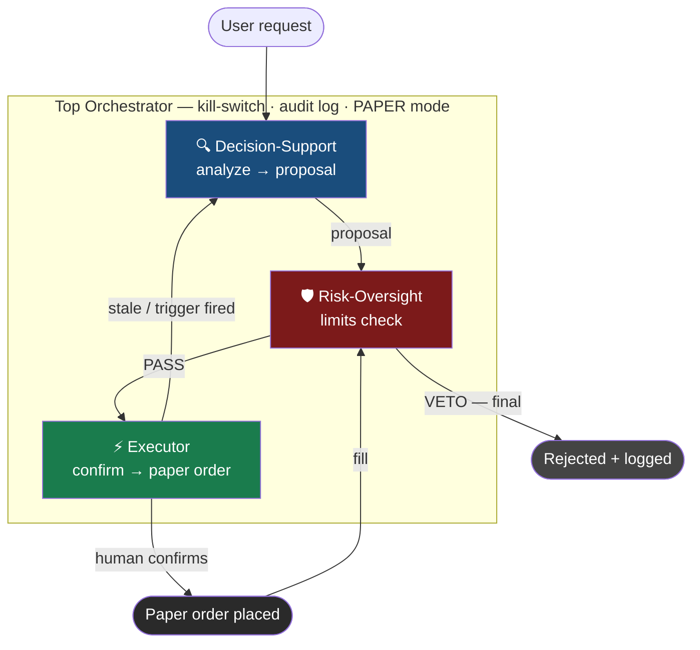
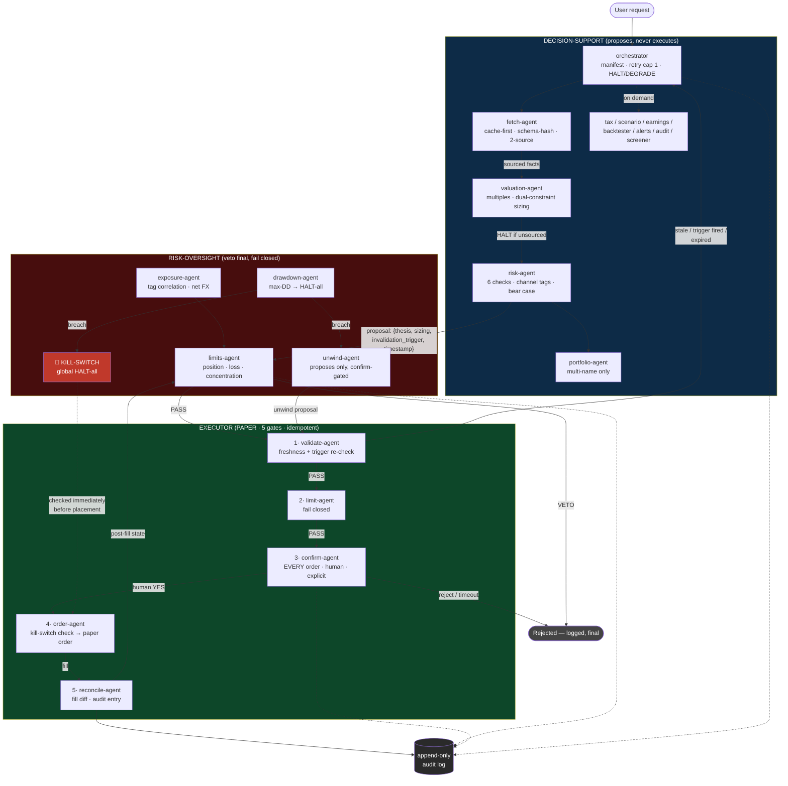

# TASE Trading System — Agentic Scaffold

> **Earlier design, not under active development.** `../market-watch/` is the
> active project — a fuller implementation with a tested deterministic core,
> a real CLI, and working CI. This tree is kept for reference and for its
> confirm-gated executor design, which some future work here may still draw
> on.

Three-subtree agent hierarchy for Israeli stock market (TASE) analysis and confirm-gated paper execution, built for Claude Code. Decision-support proposes, risk-oversight enforces, executor acts — every order human-confirmed, PAPER mode only.

## High-level flow



## Detailed production flow



## Structure

```
trading-system/
├── CLAUDE.md                 top orchestrator: routing, authority order, kill-switch,
│                             audit log, autonomous discovery loop + review queue
├── SECURITY.md               canonical security policy (all subtrees reference it)
├── eval-checklist.md         SYSTEM-LEVEL boundary tests (highest-severity class)
├── flow-high-level.mermaid   diagrams (same as embedded above)
├── flow-detailed.mermaid
│
├── decision-support/         analysis subtree — proposes, never executes
│   ├── CLAUDE.md             TASE analyst persona (standalone + hierarchy modes)
│   └── agents/
│       ├── orchestrator.md   manifest, dispatch, escalation, proposal emit
│       ├── fetch / valuation / risk / portfolio-agent.md      (core pipeline)
│       ├── tax / scenario / earnings / backtester-agent.md    (on-demand)
│       ├── alerts / audit / screener-agent.md                 (scheduled)
│       ├── schemas/          expected response shapes per source (TASE, BoI,
│       │                     CBS, EDGAR, ISA) — schema-hash validation
│       └── evals/eval-checklist.md
│
├── executor/                 PAPER only — five mandatory gates, idempotent
│   └── agents/               orchestrator + validate / limit / confirm /
│                             order / reconcile-agent + eval-checklist
│
└── risk-oversight/           sits above both — veto final, fail closed
    └── agents/               orchestrator + limits / exposure / drawdown /
                              unwind-agent + eval-checklist
```

## Related: market-watch

`../market-watch/` (repo root) is a separate, self-contained ₪100,000 PAPER
simulation system — deterministic Python core with tests, a real CLI, real
Claude Code subagents, and its own CI. It supersedes an earlier
`virtual-portfolio-simulator/` scaffold that lived under this tree. It is
deliberately **not** nested here and does not route through this tree's
confirm-gated `executor/`: it has no broker connection or path to real
capital, so — per its own `CLAUDE.md` — it is allowed to self-execute
simulated fills without a human confirm step, a reasoning that would not hold
if this system were ever wired to a real venue. See `market-watch/README.md`
and `market-watch/CLAUDE.md` for the full design.

## Core invariants

1. **Decision-support never executes.** Emits proposals `{thesis, sizing, invalidation_trigger, analysis_timestamp}`; every thesis carries a mandatory bear case and invalidation trigger.
2. **Risk-oversight veto is final** and fails closed — unreadable state means VETO, never pass.
3. **Executor's five gates, every order**: fresh data → trigger-not-fired → limit-cleared → human-confirmed → kill-switch-clear. Idempotency key prevents duplicate orders on retry.
4. **Human confirm gate is structural, not configurational.** No flag or mode allows self-execution — paper or live. The autonomous discovery loop (screener → pipeline → risk-oversight → review queue) closes everywhere except this gate.
5. **PAPER mode only.** Flipping to LIVE is an out-of-band architecture decision, never in-session, never LLM-initiated.
6. **HALT/DEGRADE vocabulary** system-wide: HALT = refuse output entirely (orchestrator retries once max, then reports the gap); DEGRADE = produce with downgraded confidence.
7. **All numbers sourced and timestamped**; schema-hash validation on every data-source response; two-source confirmation for hard numbers.

## Usage

Drop the tree at a repo root. Run Claude Code from `trading-system/` for the full hierarchy, or from `decision-support/` for standalone analyst mode. Run `eval-checklist.md` items (or dispatch audit-agent) after any prompt edit — boundary failures block deployment.

Not a licensed investment or tax advisor. Analysis output is decision support; every trade decision and confirmation is yours.
